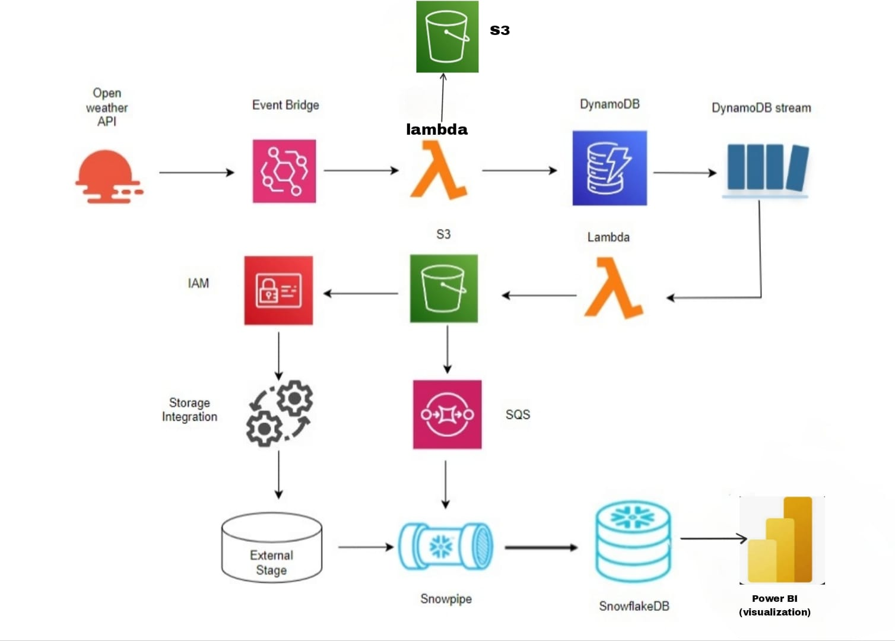

# weatherapianalysis 🌦️

This project collects real-time weather data from OpenWeather API, stores it in AWS DynamoDB and S3, and ingests it into Snowflake using Snowpipe.

## 🔧 Technologies Used
- AWS Lambda
- Amazon S3
- DynamoDB
- Snowflake
- Python
- SQL

## 📊 Architecture

-- Data Ingestion Flow --------
OpenWeather API: Periodically fetches weather data.
EventBridge: Triggers a Lambda function when new data is available.
Lambda Function: Parses the data and writes it to DynamoDB and S3.

-- Data Processing -----
DynamoDB Stream: Detects changes in the table and triggers another Lambda.
Lambda: Can enrich, transform, or forward the data.
S3 to SQS: S3 sends an event notification to SQS upon new file uploads.

-- Secure Data Integration -----
IAM: Provides role-based secure access to S3 buckets.
Storage Integration: Facilitates trusted access between AWS and Snowflake.

-- Snowflake Integration -----
External Stage: Snowflake uses this to access data stored in S3.
Snowpipe: Automatically loads new data from S3 into SnowflakeDB using notifications from SQS.

-- Data Visualization -----

SnowflakeDB: Stores curated weather data.
Power BI: Connects to Snowflake to create dashboards and visualize weather trends.

## 📁 Files
- `weatherapicodes.py`: Python Lambda code to fetch weather data
- `weatherapi.sql`: Data ingestion & transformation queries
- `Taskpowerbi.pbix`: Power BI dashboard file for visualizing weather data
